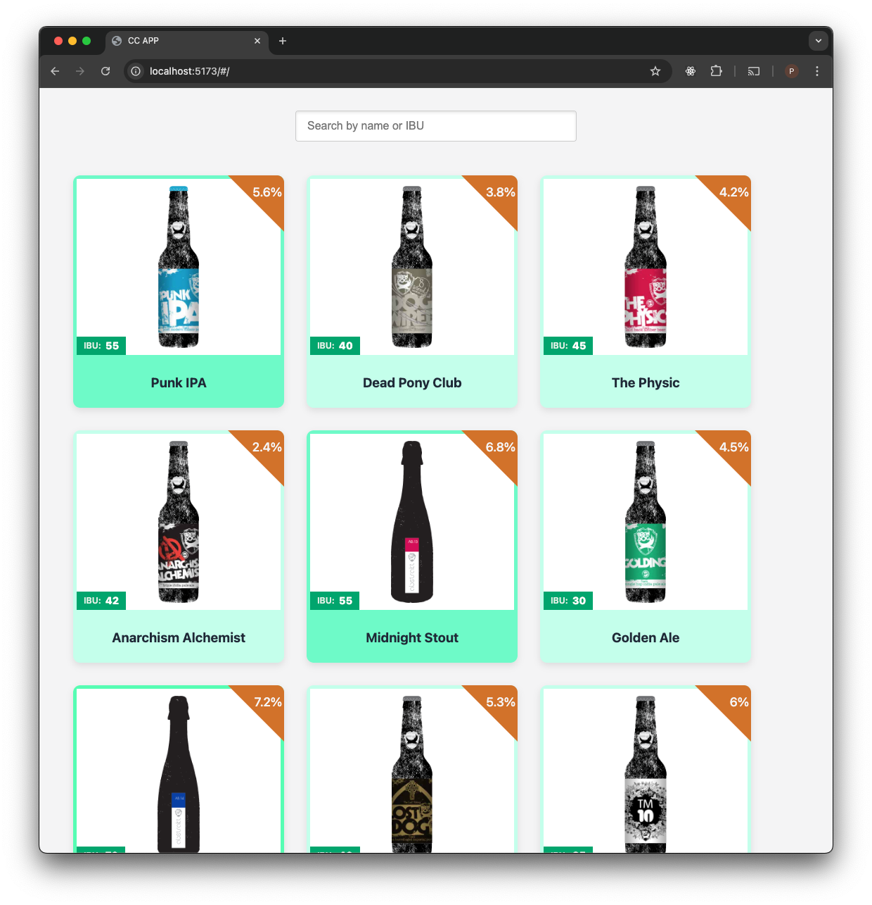
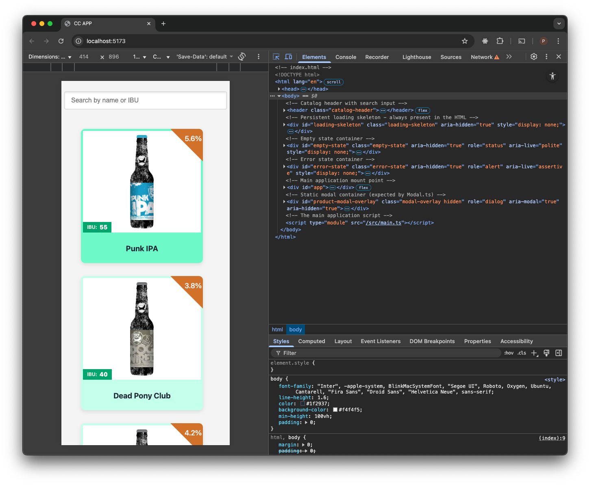
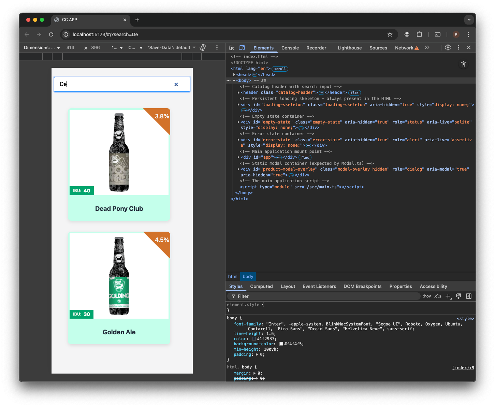
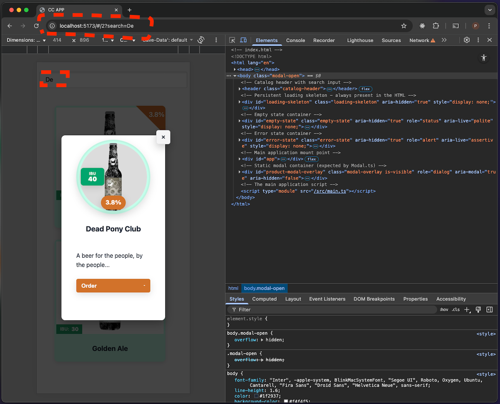
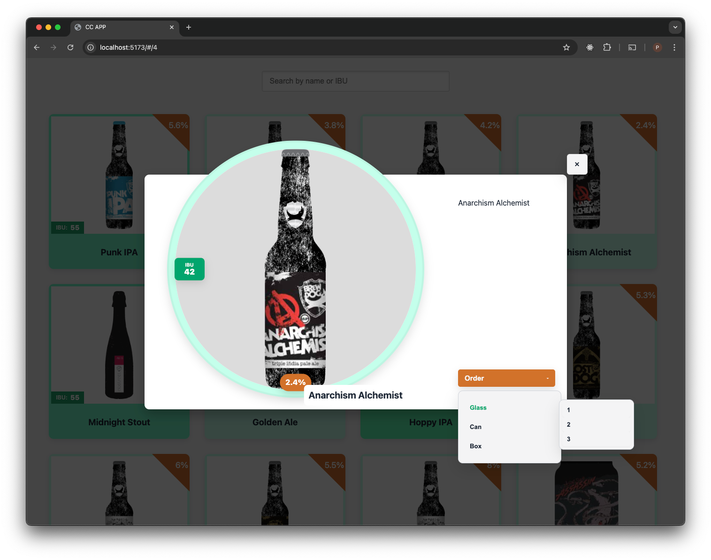

# 🚀 CC App

## 📝 General Description

CC App renders a list of items from an API and allows performing a search over them. No UI framework is used — the project is built with plain HTML, TypeScript and SCSS, and uses Vite as the bundler / dev server.

🔗 Live demo: https://pierfrancesco.github.io/cc-app/



## 📁 Quick project structure

- `index.html` — application entry HTML used by Vite.
- `package.json` — project scripts and devDependencies.
- `tsconfig.json` — TypeScript configuration.

- `src/` — application source code
  - `main.ts` — bootstraps the application.
  - `App.ts` — main application class (renders the grid, search, wiring to store and hash routing).
  - `router.ts` — routing helpers (parse/build hash, updateHash abstraction).
  - `utils.ts` — small UI helpers and debounce utilities used by the app.
  - `types.ts` — TypeScript types/interfaces.

  - `components/` — UI components
    - `Modal/Modal.ts`, `Modal.scss` — product modal component and styles.
    - `ProductCard/ProductCard.ts`, `ProductCard.scss` — product card component and styles.
    - `NestedDropdown/` — dropdown component used in the modal.

  - `services/` — application services
    - `api/productApi.ts` — API calls (fetch wrapper to get products).
    - `utils.ts` — service utilities (escape key handler, IBU color mapping, error helpers).

  - `store/`
    - `ProductStore.ts` — a tiny client-side store (fetching, state, subscribers).

  - `styles/` — styling assets
    - `main.scss`, `layout.scss` — main layout and entry styles.
    - `abstracts/_mixins.scss`, `_variables.scss` — design tokens and responsive mixins.
    - `base/_reset.scss` — css reset.


## ⚙️ How to run / build the app

Requirements:
- Node.js 22 (LTS/current) installed. Vite and TypeScript in the project assume a modern Node runtime.
- Yarn is suggested in these instructions but `npm` can also be used (both command variants are shown).

Install dependencies (Yarn):

```bash
yarn install
```

Or with npm:

```bash
npm install
```

Run in development (Vite dev server):

```bash
# yarn
yarn dev
# or npm
npm run dev
```

Build for production (TypeScript compile + Vite build):

```bash
# yarn
yarn build
# or npm
npm run build
```

Preview production build (Vite preview):

```bash
# yarn
yarn preview
# or npm
npm run preview
```

Notes:
- The project uses Vite's modern build pipeline; the dev server runs on a modern browser stack and ships modern JS to the browser by default.
- If you use `npm` and prefer `node` version management, ensure Node 22 is active (for example with nvm/n or your system package manager).


## ✨ Features

- Product grid rendering with responsive layout and lazy loading of images.

- Search input with debounced filtering.

- Client-side routing using URL hash (search state in the URL).

- Product detail modal with nested dropdowns for product attributes.

- Simple client-side store with subscription model.
- Error handling for API requests.
- Modular TypeScript codebase with clear separation of concerns.
- SCSS styling with variables and mixins for responsive design.
- Build setup with Vite for fast development and optimized production builds.
- No UI framework dependency; built with plain TypeScript, HTML and SCSS.
- Lightweight and performant for modern browsers.

## 🏛 Architecture

Because the restrictions of the task specified no UI frameworks, the app is built with plain TypeScript classes and modules. The architecture follows a component-based approach, where each UI part (ProductCard, Modal, etc.) is encapsulated in its own class and file.
The app uses a hybrid approach for UI element rendering: some parts are rendered via `innerHTML` templates (ProductCard), while others (Modal) use direct DOM manipulation of static elements in the index.html for dynamic parts. 
This approach is to maximize performances and compatibility with older browsers: 
- if JS fails to load, the static HTML is still present.
- if JS is slow, the static HTML is shown first, and dynamic parts are progressively enhanced.

It could've been possible to explore also the usages of web components (custom elements) for encapsulation, but given the time constraints and the need to polyfill for older browsers, this approach was not pursued.

## 🌐 Browser compatibility (APIs used in the TypeScript sources)

- `fetch()` — used in `src/services/api/productApi.ts` to request products.
  - Approx. support: Chrome >= 42, Firefox >= 39, Safari >= 10.1, Edge >= 14

- `URLSearchParams` — used to parse/serialize hash query (`router.ts` and `App.ts`).
  - Approx. support: Chrome >= 49, Firefox >= 29, Safari >= 10, Edge >= 17

- `history.replaceState()` and `location.hash` / `location.pathname` / `location.search` assignment — used by routing helpers (`router.ts`) to update the fragment without full-page navigation.
  - Approx. support: very old browsers; `history.pushState/replaceState` has broad support in modern browsers (Chrome 5+, Firefox 4+, Safari 5+, Edge 12+). This is safe on modern browsers but older IE versions may have limitations.

- `Event` constructor / `dispatchEvent` — used in `router.ts` to programmatically notify listeners (synthetic `hashchange`).
  - Approx. support: Chrome >= 15, Firefox >= 14, Safari >= 6, Edge >= 12
  - If you need to support very old browsers, use `document.createEvent('Event')` fallback.

The app targets modern browsers. If you need to support older browsers (IE11 or legacy Safari/Edge), add polyfills for `fetch` and `URLSearchParams`, and consider a small shim for `Event` in environments where `new Event()` is not available.
